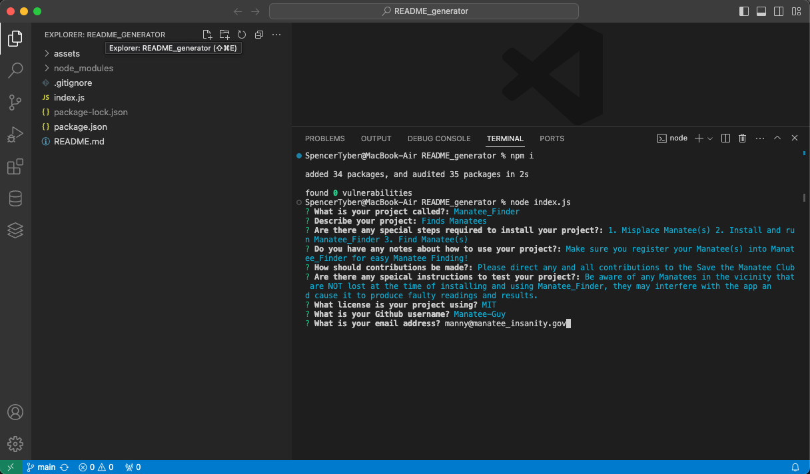

# README_generator

## Description

A README generator app for creating professional quality README.md files using a series of question prompts meant to demonstrate usage of the inquirer Node.js package.

## Link to Deployed Website

https://spec-tr.github.io/README_generator/

## Usage

1. Clone Repo
2. Open CLI (Command-Line Interface) the directory /root
3. Install Node.js packages with command "npm i"
4. Run script with command "node index.js"
5. Answer questions to generate README

## Technologies

### HTML
### CSS
### JavaScript
### Node.js

## Credits & Sources

Information and documentation used in the creation of this app, but external to the EdX UofT Full-Stack Software Development Bootcamp including syntaxes, best practises and instructional examples for usage came from the following sources:
- https://coding-boot-camp.github.io/full-stack/github/professional-readme-guide
- https://gist.github.com/lukas-h/2a5d00690736b4c3a7ba
- https://www.w3schools.com/java/java_files_create.asp
- https://www.npmjs.com/package/inquirer
- https://shields.io

## License

See LICENSE file in repository